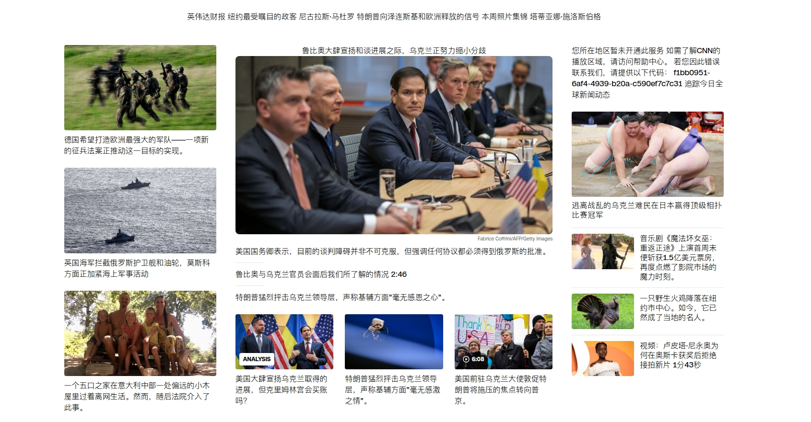
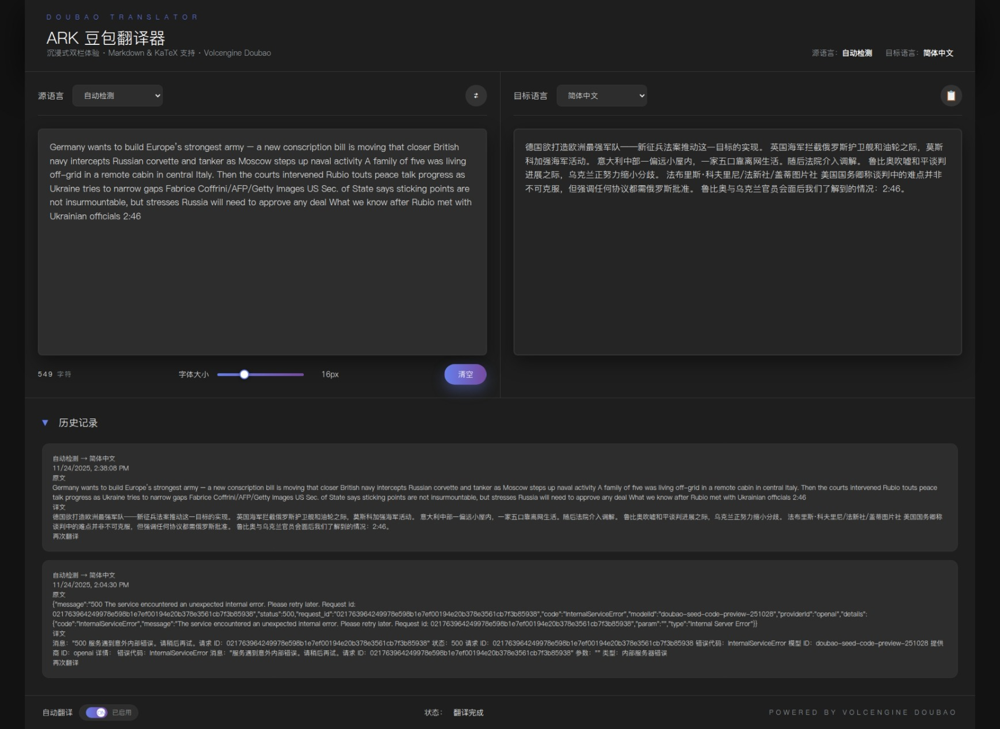

# Doubao Immersive Translator · 豆包沉浸式翻译

 

## Overview · 项目简介
Doubao Immersive Translator delivers inline, context-aware translations for any website using Volcengine Doubao Seed. It also ships with a full-screen translator workspace featuring Markdown + LaTeX rendering, debounced translation, and history syncing.

豆包沉浸式翻译基于火山引擎 Doubao Seed 模型，为任意网页提供“沉浸式、上下文感知”的内嵌翻译体验，并带有全屏译文工作台，支持 Markdown + LaTeX 渲染、实时预览以及历史记录。

---

## Features · 功能特性

- ✨ **Immersive Web Translation** – intelligent block detection, Shadow DOM rendering, GitHub-aware filters (skip code, usernames, repo slugs).
- 🖥️ **Standalone Translator Page** – split-view editor with Markdown/KaTeX preview, font slider, copy/clear controls, and chrome.storage history.
- ⚡ **High Performance** – concurrent request queue (15 workers) with local caching to avoid 429s and reduce API spend.
- 🧰 **Modern Stack** – React + Vite + crxjs + TailwindCSS + Manifest V3.
- ⚙️ **Customizable UX** – Bilingual vs Translation-only mode, font sizing, Doubao Seed integration.
- ✨ **沉浸式网页翻译**：智能段落识别 + Shadow DOM 渲染，针对 GitHub/技术文档自动跳过代码、用户名、仓库路径。
- 🖥️ **独立译文工作台**：分屏编辑器 + Markdown/KaTeX 预览，字体滑杆、复制/清空按钮、chrome.storage 历史记录。
- ⚡ **高性能**：15 并发请求队列 + 本地缓存，避免 429 及重复费用。
- 🧰 **现代技术栈**：React、Vite、crxjs、TailwindCSS、Manifest V3。
- ⚙️ **可定制体验**：双语/仅译模式、字体大小调节、深度对接 Doubao Seed。

---

## Tech Stack · 技术栈

- React 18 + React Markdown + remark-math + rehype-katex
- Vite 4 + crxjs plugin (Manifest V3 bundling)
- TailwindCSS + Custom CSS
- Chrome Extensions API (runtime, storage, contextMenus)
- Volcengine Doubao Seed Translation API

---

## Installation & Development · 安装与开发

```bash
# 1. Install dependencies
npm install

# 2. Start watch build (outputs to dist/ with HMR-like rebuilds)
npm run watch
```

1. Open Chrome/Edge → `chrome://extensions/`.
2. Enable **Developer Mode**.
3. Click **Load unpacked** → choose the `dist/` folder.
4. For development, keep `npm run watch` running and refresh the extension.

1. 安装依赖：`npm install`
2. 运行监听构建：`npm run watch`
3. 打开 Chrome/Edge → `chrome://extensions/` → 开启开发者模式
4. 点击“加载已解压的扩展程序”，选择 `dist/` 目录
5. 开发时保持 `npm run watch` 运行，刷新扩展即可生效

---

## Configuration · 配置

1. Open the popup and paste your Volcengine API key (Doubao Seed).
2. Choose target language, display mode, and save.
3. Click **Translate This Page** or **Open Full Translator**.

1. 打开弹窗，输入火山引擎 Doubao Seed API Key。
2. 设置目标语言、显示模式，点击保存。
3. 可选择“翻译当前页面”或“打开全屏译文工作台”。

 

## Screenshots · 截图

- Popup / Page Translation

  

- Translator Workspace

  

---

## License · 许可证

MIT © 2025 Doubao Immersive Translator
