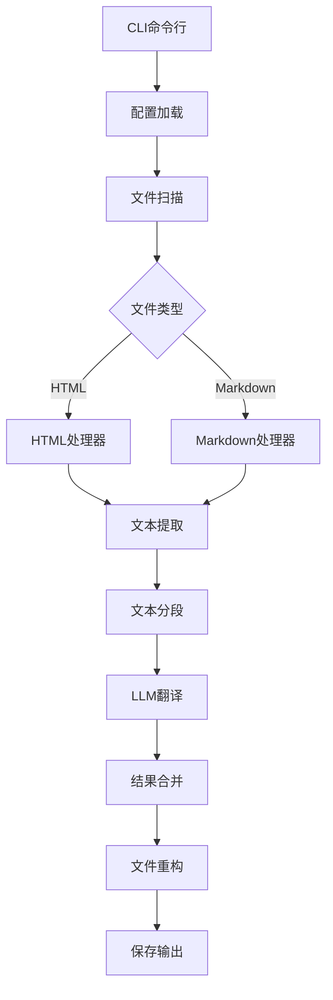

# Doubao HTML+Markdown Batch Translator 项目计划书

## 一、项目概述
**项目名称**：Doubao HTML+Markdown Batch Translator  
**核心目标**：实现批量HTML/Markdown文件翻译工具，保留原始格式，适配Doubao模型限制。  
**适用场景**：技术文档翻译、网页本地化、Markdown笔记跨语言转换。


## 二、核心功能
1. **文件类型支持**：
   - ✅ HTML：保留DOM结构，仅翻译文本节点（跳过标签/注释）
   - ✅ Markdown：保留所有标记（标题/链接/列表等），跳过代码块
2. **批量处理**：
   - 支持指定输入目录/文件
   - 自定义输出目录，保留原始文件结构
3. **模型适配**：
   - 文本自动分段（适配输入1k token限制）
   - 上下文管理（避免超过4k窗口）
4. **配置管理**：
   - dotenv管理API密钥
   - 支持自定义翻译语言（源语言→目标语言）


## 三、技术架构


### 关键模块说明
1. **文本分段策略**（适配模型限制）：
   - 单段最大长度：**900 tokens**（预留100 token用于上下文）
   - 分段规则：
     - 按段落/句子分割，避免破坏语义
     - HTML：按DOM节点层级分段
     - Markdown：按段落/列表项分段
   - 上下文传递：每段翻译包含前200 tokens上下文，确保连贯性

2. **LLM调用适配**：
   - 支持OpenAI兼容协议（Doubao已适配）
   - 批量请求优化（避免单次请求过长）
   - 错误重试机制（API调用失败自动重试）


## 四、依赖安装
```bash
# 核心依赖
npm install dotenv commander openai marked

# 类型依赖（开发环境）
npm install --save-dev @types/dotenv @types/commander @types/marked
```


## 五、实现步骤
### 阶段1：基础框架（1天）
1. 初始化CLI命令行接口（commander）
2. 实现配置加载（dotenv）
3. 编写LLM客户端（适配Doubao API）

### 阶段2：核心处理器（2天）
1. HTML处理器：
   - 解析/提取文本节点
   - 分段逻辑实现
   - 重构DOM结构
2. Markdown处理器：
   - 解析/提取文本（跳过代码块）
   - 分段逻辑实现
   - 重构Markdown格式

### 阶段3：批量处理（1天）
1. 目录扫描与文件识别
2. 批量翻译流程实现
3. 输出目录管理

### 阶段4：测试与优化（1天）
1. 单元测试（HTML/Markdown解析）
2. 集成测试（完整翻译流程）
3. 性能优化（分段效率）


## 六、模型限制适配细节
| 模型参数          | 限制值 | 适配策略                          |
|-------------------|--------|-----------------------------------|
| 上下文窗口        | 4k     | 每段保留前200 token上下文         |
| 最大输入Token     | 1k     | 单段文本≤900 token                |
| 最大输出Token     | 3k     | 自动拆分长文本为多段翻译          |
| TPM（每分钟Token）| 500k   | 批量请求限流（避免触发限制）      |
| RPM（每分钟请求） | 5k     | 并发请求控制（最大并发≤10）       |


## 七、测试计划
1. **功能测试**：
   - HTML翻译：输入含复杂DOM的文件，验证结构保留
   - Markdown翻译：输入含代码块/列表的文件，验证标记保留
2. **性能测试**：
   - 批量处理100个文件（总大小10MB），验证速度
   - 长文本（5k token）分段翻译，验证连贯性
3. **边界测试**：
   - 空文件/极短文本翻译
   - 含特殊字符的文本翻译


## 八、后续扩展
1. Excel翻译支持（需解析二进制格式）
2. 多语言切换（支持更多目标语言）
3. 网页抓取功能（直接翻译在线网页）
4. 可视化界面（Electron打包）